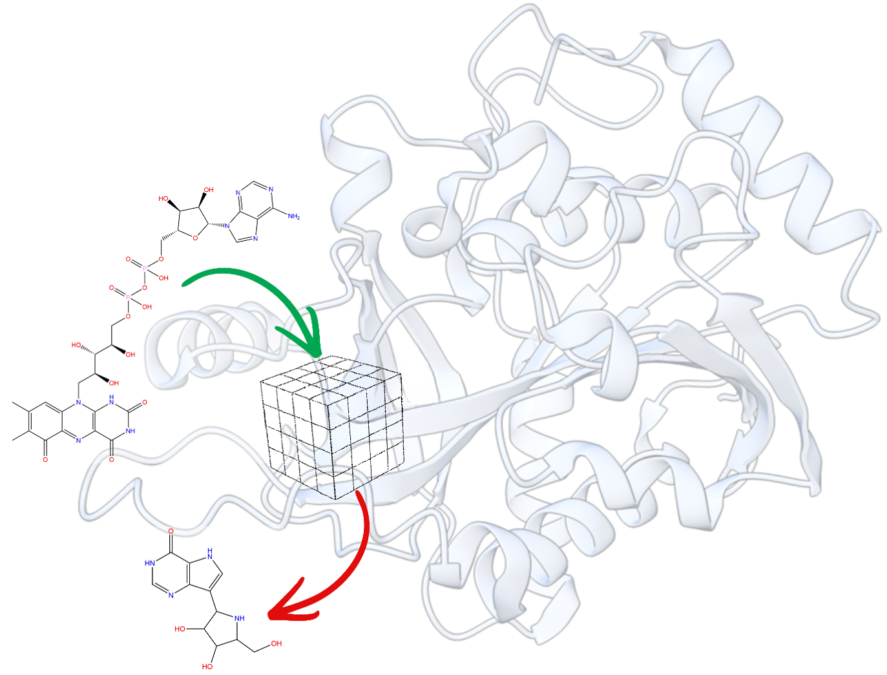

# Repurposing Nucleos(t)ide Analogs as Purine Nucleoside Phosphorylase Inhibitors through Gaussian Accelerated Molecular Dynamics Simulations

<p align="center">
  
</p>

---

## Overview

This repository contains the supplementary computational data, molecular dynamics input files, and analysis associated with the manuscript:

**Repurposing Nucleos(t)ide Analogs as Purine Nucleoside Phosphorylase Inhibitors through Gaussian Accelerated Molecular Dynamics Simulations**

Purine nucleoside phosphorylase (PNP) is a key enzyme in the purine salvage pathway and an important therapeutic target for T-cell-mediated autoimmune diseases, leukemia, lymphoma, and other immune disorders. In this study, we developed an integrated computational drug-repurposing workflow combining virtual screening, molecular docking, Gaussian accelerated molecular dynamics (GaMD), MM-PBSA free-energy calculations, and AI-based affinity prediction to identify promising nucleos(t)ide analogs as potential PNP inhibitors. The workflow prioritized four candidate compounds, among which **6-hydroxy-flavin adenine dinucleotide (6-hydroxy-FAD)** demonstrated the most favorable binding stability and predicted binding affinity. :contentReference[oaicite:0]{index=0}

---

## Repository Contents

```
PNP-Inhibitors/
│
├── Graphical_abstract.png
├── README.md
├── LICENSE
│
Supporting_Data/
│
├── README.md
├── Table_S1_C0_PerResidue_MM_PBSA.xlsx
├── Table_S2_C1_PerResidue_MM_PBSA.xlsx
├── Table_S3_C2_PerResidue_MM_PBSA.xlsx
├── Table_S4_C3_PerResidue_MM_PBSA.xlsx
├── Table_S5_C4_PerResidue_MM_PBSA.xlsx
├── Docking_Grid_Coordinates.xlsx
└── Virtual_Screening_Results.xlsx

## Computational Workflow

- Collection of approximately **800 nucleos(t)ide analogs** from DrugBank and MODOMICS
- Structure-based virtual screening
- Molecular docking
- Gaussian accelerated molecular dynamics (500 ns)
- MM-PBSA binding free-energy calculations
- Per-residue MM-PBSA decomposition
- AI-based binding affinity prediction
- Structural interaction analysis
- Free-energy landscape analysis

---

## Major Findings

- 800 nucleos(t)ide analogs were screened against human PNP.
- Four candidate inhibitors were selected for extensive molecular dynamics simulations.
- **6-hydroxy-flavin adenine dinucleotide (C2)** consistently exhibited the strongest predicted binding affinity and the most stable binding mode.
- MM-PBSA, AI-based scoring, clustering, and free-energy landscape analyses collectively supported C2 as the most promising inhibitor candidate. :contentReference[oaicite:1]{index=1}

---

## Software

- AMBER24
- PyRx
- RASPD+
- CPPTRAJ
- MMPBSA.py
- PyMOL
- ChimeraX

---

## Citation

If you use this repository, please cite:

**Gupta T., Sharma P., Tiwari C., Malik S., Pant P.**

*Repurposing Nucleos(t)ide Analogs as Purine Nucleoside Phosphorylase Inhibitors through Gaussian Accelerated Molecular Dynamics Simulations.*

---

## License

This repository is released under the MIT License.
